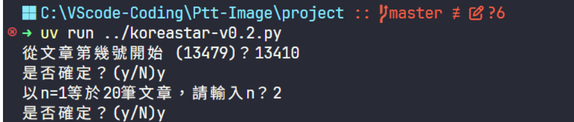

# ptt-image
## 本程式主要是把ptt網址中將KoreaDrama (https://disp.cc/b/KoreaDrama)和KoreaStart (https://disp.cc/b/Koreastar) 的圖片透過程式把它下載下來

1. 利用下列命令取得uv.exe工具
> python -m pip install uv

2. 利用下面命令建立工作目錄project
> uv init project

3. 用下面命令進入project工作目錄
> cd project

4. 下載python的第三方套件，同時建立虛擬環境(.venv)
> uv add requests bs4

5. 使用下面命令編譯程式，這支程式是為抓取"KoreaDrama" 所有圖片
> uv run ../koreadrama-v0.2.py
> 

6. 使用下面命令編譯程式，這支程式是為抓取"KoreaStart" 所有圖片
> uv run ../koreastart-v0.2.py
>

